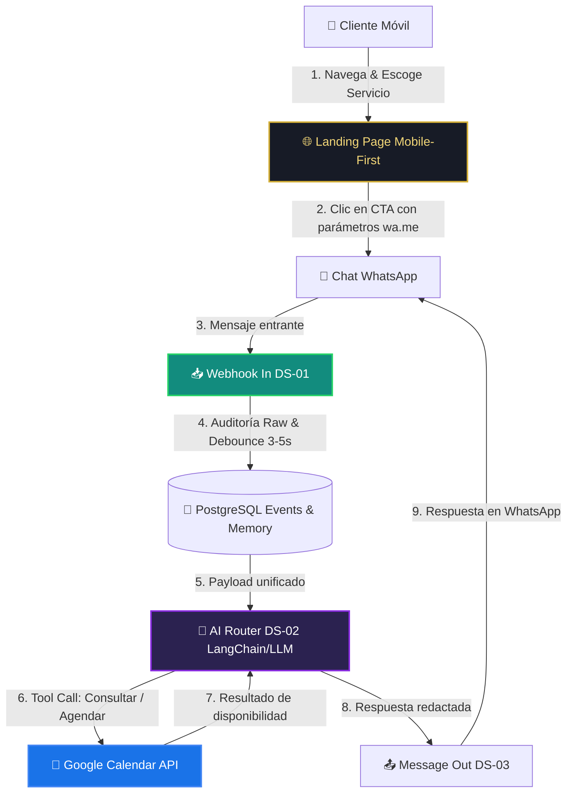

# 💈 Andrés Díaz | Sistema Inteligente de Captura y Agendamiento por WhatsApp con IA

<p align="center">
  
</p>

<p align="center">
  <strong>Solución B2B Full-Stack para Salones de Belleza y Barberías en Latinoamérica</strong><br>
  Landing Page de Alta Conversión • Agente IA en WhatsApp 24/7 • Orquestación n8n • Google Calendar API • Base de Datos PostgreSQL
</p>

<p align="center">
  
  
  
  
</p>

---

## 📌 1. Visión del Proyecto & Retorno de Inversión (ROI)

En Latinoamérica, los salones de belleza y estilistas de alto nivel pierden entre el **30% y el 45% de sus clientes potenciales** debido a:
1. **Falta de respuesta inmediata:** El estilista está atendiendo a un cliente con las manos ocupadas y no puede responder WhatsApp a tiempo.
2. **Inasistencias ("No-Shows"):** Citas agendadas en libretas de papel sin confirmación ni recordatorios automáticos.
3. **Fricción en la cotización:** Clientes que preguntan precios y se van sin agendar porque el proceso es lento.

### 💡 La Solución
Un **"Recepcionista Virtual Inteligente 24/7"** que atiende en WhatsApp en menos de 5 segundos, responde dudas de servicios (precios, técnicas, cuidados), califica la intención del cliente desde una Landing Page móvil, consulta la disponibilidad real y agenda directamente en Google Calendar.

> **Métrica de Retorno:** Con solo **2 citas recuperadas al mes**, el sistema paga por completo cualquier costo operativo futuro.

---

## 🏗️ 2. Arquitectura del Sistema



---

## 📂 3. Estructura del Repositorio

El proyecto implementa la metodología **Full-Stack Automator** con arquitectura limpia y modular:

```text
📦 AndresPeluqueria
 ┣ 📂 landing/                 # Frontend del embudo de captura
 ┃ ┣ 📜 index.html             # Maquetación semántica mobile-first
 ┃ ┣ 📜 styles.css             # Dark Mode Premium con acentos dorados
 ┃ ┣ 📜 script.js              # Enlaces wa.me dinámicos y detector de horarios en vivo
 ┃ ┣ 📜 serve.js               # Servidor de previsualización local (Node.js nativo)
 ┃ ┗ 📂 assets/images/         # Fotografías reales de Andrés y sus clientas
 ┣ 📂 infra/                   # Orquestación de contenedores y variables
 ┃ ┣ 📜 docker-compose.yml     # n8n, PostgreSQL y túneles seguros
 ┃ ┗ 📜 .env.example           # Plantilla con todas las variables de entorno
 ┣ 📂 database/                # Esquemas y persistencia relacional
 ┃ ┣ 📂 init/                  # 01_schema.sql (tablas) y 02_functions.sql (debounce)
 ┃ ┣ 📂 migrations/            # Cambios futuros controlados
 ┃ ┗ 📂 queries/               # Consultas analíticas y reportes
 ┣ 📂 workflows/               # Código fuente de n8n exportado en JSON
 ┃ ┣ 📂 core/                  # DS-00 (Errores), DS-01 (In), DS-02 (AI Router), DS-03 (Out)
 ┃ ┣ 📂 tools/                 # T-01 (Disponibilidad), T-02 (Crear Cita), T-03 (Escalar Humano)
 ┃ ┗ 📂 crons/                 # C-01 (Recordatorio de citas 2h antes)
 ┣ 📂 docs/                    # Documentación de ingeniería y comercial
 ┃ ┣ 📜 METODOLOGIA.md         # Estándar y convenciones de trabajo
 ┃ ┣ 📜 REQUERIMIENTOS.md      # Requerimientos funcionales y no funcionales
 ┃ ┗ 📜 ROADMAP_LANDING.md     # Checklist paso a paso del embudo
 ┣ 📂 .github/                 # Plantillas de Issues y Pull Requests
 ┣ 📜 AGENTS.md                # Reglas inquebrantables del asistente AI
 ┣ 📜 CONTRIBUTING.md          # Guía de contribución y ramas
 ┣ 📜 LICENSE                  # Licencia de uso
 ┣ 📜 .gitignore               # Exclusión de claves y datos sensibles
 ┗ 📜 README.md                # Este archivo
```

---

## ⚙️ 4. Stack Tecnológico (Costo $0 para MVP)

| Componente | Tecnología | Justificación & Nivel de Costo |
|---|---|---|
| **Frontend** | HTML5, Vanilla CSS & JS | Carga en <1.2s en redes 4G móviles. 100% libre de dependencias. |
| **Hosting Web** | Cloudflare Pages / Vercel | Costo $0 / mes con SSL automático y CDN global. |
| **WhatsApp Gateway** | Meta Cloud API / Evolution API | 1.000 conversaciones gratuitas mensuales de servicio. |
| **Motor n8n** | n8n Community Edition | Auto-hospedado en Docker. Cero límites de ejecuciones. |
| **Base de Datos** | PostgreSQL 16 | Persistencia de eventos crudos, debounce de mensajes y memoria. |
| **Modelos de IA** | Google Gemini 2.0 Flash / Groq / OpenAI | Tiers gratuitos con soporte nativo de Function / Tool Calling. |
| **Calendario** | Google Calendar API | Integración directa y gratuita para reservas sin solapamiento. |

---

## 🚦 5. Roadmap de Implementación (5 Fases)

- [x] **Fase 1: Preparación, Arquitectura & Metodología**
  - [x] Levantamiento formal de requerimientos ([docs/REQUERIMIENTOS.md](docs/REQUERIMIENTOS.md)).
  - [x] Reglas del proyecto en [AGENTS.md](AGENTS.md).
  - [x] Estructuración de carpetas y repositorios.
- [x] **Fase 2: Landing Page & Embudo a WhatsApp**
  - [x] Maquetación mobile-first y diseño Dark Mode con acentos dorados.
  - [x] Inyección de parámetros dinámicos en enlaces `wa.me/`.
  - [x] Integración de fotografías y logo real de Andrés Díaz.
- [ ] **Fase 3: Motor N8N & Agente IA**
  - [ ] Flujo `DS-01_WebhookIn` con tabla `eventos_webhook` y función Debounce.
  - [ ] Flujo `DS-02_AgentRouter` con memoria y Function Calling.
  - [ ] Sub-flujos de herramientas `T-01` (Disponibilidad) y `T-02` (Crear Cita).
  - [ ] Flujo de salida unificado `DS-03_MessageOut`.
- [ ] **Fase 4: Sandbox & Manejo de Casos Borde**
  - [ ] Pruebas anti-doble booking y solapamientos.
  - [ ] Sistema de escape y pausa humana (`T-03_EscalarHumano`).
- [ ] **Fase 5: Despliegue en Producción & Capacitación**
  - [ ] Despliegue en VPS / Servidor Cloud.
  - [ ] Capacitación al dueño y activación de recordatorios automáticos.

---

## 🚀 6. Cómo Ejecutar el Proyecto Localmente

### Prerrequisitos:
- **Node.js** (v18+) instalado.
- **Git** instalado.
- **Docker & Docker Compose** (para levantar n8n y PostgreSQL en Fase 3).

### Pasos Rápidos:

1. **Clonar el repositorio:**
   ```bash
   git clone https://github.com/TU_USUARIO/AndresPeluqueria.git
   cd AndresPeluqueria
   ```

2. **Probar la Landing Page:**
   ```bash
   node landing/serve.js
   ```
   Abre tu navegador en: [http://localhost:3000](http://localhost:3000)

3. **Configurar el número de WhatsApp comercial:**
   Edita `landing/script.js` y asigna el número en la variable `whatsappNumber`:
   ```javascript
   const BUSINESS_CONFIG = {
     whatsappNumber: '573XXXXXXXXX', // Número del cliente con código de país
     ...
   };
   ```

---

## 🤝 7. Contribución y Buenas Prácticas

Consulta nuestra [Guía de Contribución](CONTRIBUTING.md) para conocer las convenciones de Git, ramas (`main`, `dev`, `feature/*`) y el formato de commits estándar.

---

## 📄 8. Licencia

Este proyecto está bajo la Licencia **MIT**. Consulta el archivo [LICENSE](LICENSE) para más detalles.
